# RiteCare — Field Service Document Intelligence

## System Architecture

```mermaid
flowchart TD
    subgraph UI["User Interface"]
        CLI["run_agent.py\nCLI Chat"]
        TEST["test_agent.py\nTest Runner"]
        SLACK["Slack\nPhase 5"]
    end

    subgraph AGENT["LangGraph Agent  (agent/)"]
        STATE["AgentState\nmessages · intent · tool_results\nsession_id · channel"]

        subgraph GRAPH["StateGraph  (graph.py)"]
            N1["1. intent_classifier\n─────────────────\nGPT-4o-mini\nRoutes query to BU\nCRUD or RAG or BOTH"]
            N2["2. tool_executor\n─────────────────\nCalls CRUD tools\nCalls RAG tools\nCollects results"]
            N3["3. responder\n─────────────────\nGPT-4o-mini\nSynthesises results\nNatural language response"]
        end

        N1 -->|intent| N2
        N2 -->|tool_results| N3
    end

    subgraph PROMPTS["Prompts  (agent/prompts/)"]
        SP["system_prompt.py\nRiteCare context\nBU descriptions\nTool guidance"]
    end

    subgraph TOOLS["RiteCare Tools  (ritecare_tools/)"]
        direction LR
        T1["bu1_tools.py\nget_customer_by_id\nget_onboarding_status\nsearch_onboarding_docs"]
        T2["bu2_tools.py\nget_contract_by_id\nlist_contracts\nlist_visits\nsearch_service_manuals"]
        T3["bu3_tools.py\nget_subscription\nlist_invoices\nsearch_billing_statements"]
        T4["bu4_tools.py\nget_ticket_by_id\nlist_tickets\nsearch_knowledge_base\nsearch_resolved_tickets"]
        T5["rag_tools.py\nsearch_all_bus\nsearch_bu_documents"]
    end

    subgraph SERVICES["BU Microservices  (services/)  —  FastAPI + Motor"]
        direction LR

        subgraph BU1["BU1 — Customer Onboarding  :8001"]
            B1A["api/router.py\nPOST /customers\nGET /customers/id\nPATCH /customers/id/kyc\nGET /customers/id/onboarding-status\nPOST /ingest\nPOST /rag/search"]
            B1B["service/\ncustomer_service.py"]
            B1C["dao/\ncustomer_dao.py\nvector_dao.py"]
            B1A --> B1B --> B1C
        end

        subgraph BU2["BU2 — Sales & Maintenance  :8002"]
            B2A["api/router.py\nPOST /contracts\nGET /contracts/id\nGET /contracts/customer/id\nPOST /visits\nGET /visits/customer/id\nPATCH /visits/id\nPOST /ingest\nPOST /rag/search"]
            B2B["service/\ncontract_service.py\nvisit_service.py"]
            B2C["dao/\ncontract_dao.py\nvisit_dao.py\nvector_dao.py"]
            B2A --> B2B --> B2C
        end

        subgraph BU3["BU3 — Billing & Subscription  :8003"]
            B3A["api/router.py\nPOST /invoices\nGET /invoices/customer_id\nPATCH /invoices/id/pay\nPOST /subscriptions\nGET /subscriptions/customer_id\nPATCH /subscriptions/customer_id\nPOST /ingest\nPOST /rag/search"]
            B3B["service/\ninvoice_service.py\nsubscription_service.py"]
            B3C["dao/\ninvoice_dao.py\nsubscription_dao.py\nvector_dao.py"]
            B3A --> B3B --> B3C
        end

        subgraph BU4["BU4 — Support & Fulfillment  :8004"]
            B4A["api/router.py\nPOST /tickets\nGET /tickets/id\nGET /tickets/customer/id\nPATCH /tickets/id/status\nPOST /tickets/id/escalate\nPOST /ingest\nPOST /rag/search"]
            B4B["service/\nticket_service.py"]
            B4C["dao/\nticket_dao.py\nvector_dao.py"]
            B4A --> B4B --> B4C
        end
    end

    subgraph INGESTION["Ingestion Pipeline  (per BU — ingestion/)"]
        direction LR
        IL["loaders/\npdf_loader.py\ntext_loader.py"]
        IC["chunker.py\n~500 token chunks"]
        IE["embedder.py\nOpenAI\ngemini-embedding-001\n1536 dimensions"]
        IL --> IC --> IE
    end

    subgraph DB["MongoDB Atlas"]
        direction LR
        C1[("customers\n────────\nBU1 CRUD")]
        C2[("contracts\nvisits\n────────\nBU2 CRUD")]
        C3[("invoices\nsubscriptions\n────────\nBU3 CRUD")]
        C4[("tickets\n────────\nBU4 CRUD")]
        V1[("bu1_document_chunks\n────────────────────\nVector Index")]
        V2[("bu2_document_chunks\n────────────────────\nVector Index")]
        V3[("bu3_document_chunks\n────────────────────\nVector Index")]
        V4[("bu4_document_chunks\n────────────────────\nVector Index")]
    end

    subgraph SHARED["Shared  (shared/)"]
        CFG["config.py\nPydantic Settings\n.env loader"]
        LOG["logging.py\nstructlog JSON"]
    end

    subgraph DBMOD["DB Models  (db/)"]
        CONV["models/conversation.py\nSession history\nMongoDB document"]
        DBCL["client.py\nMotor singleton"]
    end

    %% User → Agent
    CLI --> STATE
    TEST --> STATE
    SLACK -.->|Phase 5| STATE

    %% Agent uses prompts
    SP --> N1
    SP --> N3

    %% Agent uses tools
    N2 --> T1
    N2 --> T2
    N2 --> T3
    N2 --> T4
    N2 --> T5

    %% Tools call BU APIs
    T1 -->|HTTP| BU1
    T2 -->|HTTP| BU2
    T3 -->|HTTP| BU3
    T4 -->|HTTP| BU4
    T5 -->|Motor| DB

    %% BU APIs call MongoDB
    B1C -->|Motor| C1
    B2C -->|Motor| C2
    B3C -->|Motor| C3
    B4C -->|Motor| C4
    B1C -->|Vector Search| V1
    B2C -->|Vector Search| V2
    B3C -->|Vector Search| V3
    B4C -->|Vector Search| V4

    %% Ingestion → MongoDB
    IE -->|store chunks| V1
    IE -->|store chunks| V2
    IE -->|store chunks| V3
    IE -->|store chunks| V4

    %% Ingestion triggered via API
    B1A -->|POST /ingest| INGESTION
    B2A -->|POST /ingest| INGESTION
    B3A -->|POST /ingest| INGESTION
    B4A -->|POST /ingest| INGESTION

    %% Shared config used everywhere
    CFG -.-> AGENT
    CFG -.-> TOOLS
    CFG -.-> INGESTION

    %% Conversation persistence
    N3 -->|save turn| CONV
    DBCL --> CONV
```



---

## Layer Responsibilities

| Layer                  | Location                        | Responsibility                                     |
| ---------------------- | ------------------------------- | -------------------------------------------------- |
| **User Interface**     | `run_agent.py`, `test_agent.py` | Entry points — CLI chat and test runner            |
| **LangGraph Agent**    | `agent/`                        | Orchestrates classify → execute → respond pipeline |
| **RiteCare Tools**     | `ritecare_tools/`               | HTTP wrappers calling BU APIs + RAG vector search  |
| **BU Microservices**   | `services/buN_*/`               | FastAPI REST APIs — CRUD + ingest + RAG search     |
| **Ingestion Pipeline** | `services/buN_*/ingestion/`     | PDF/text → chunks → embeddings → MongoDB           |
| **MongoDB Atlas**      | Cloud                           | CRUD collections + Vector Search index per BU      |
| **Shared**             | `shared/`                       | Config (Pydantic Settings), structured logging     |
| **DB Models**          | `db/`                           | Conversation history model, Motor client singleton |

---

## Data Flow — Query

```
User query
  → AgentState initialised
  → intent_classifier  →  "INTENT: BU2+BU4, TOOLS: BOTH"
  → tool_executor      →  calls get_ticket_by_id (HTTP → BU4)
                       →  calls search_service_manuals (HTTP → BU2 /rag/search)
                       →  tool_results collected
  → responder          →  GPT-4o-mini synthesises results
  → final_response     →  returned to user
```

## Data Flow — Document Ingestion

```
POST /ingest  (multipart PDF upload)
  → pdf_loader    →  extract raw text
  → chunker       →  split into ~500 token chunks
  → embedder      →  OpenAI gemini-embedding-001 (1536 dims)
  → vector_dao    →  insert chunks into buN_document_chunks
  → response      →  { "chunks_stored": N }
```

---

## Port Map

| Service                      | Port |
| ---------------------------- | ---- |
| BU1 — Customer Onboarding    | 8001 |
| BU2 — Sales & Maintenance    | 8002 |
| BU3 — Billing & Subscription | 8003 |
| BU4 — Support & Fulfillment  | 8004 |
